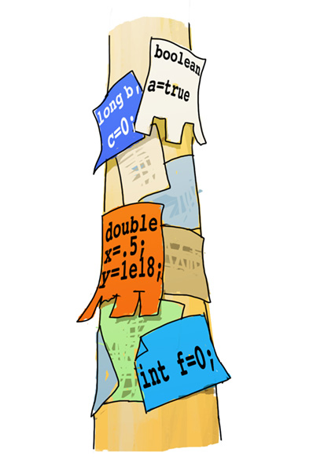
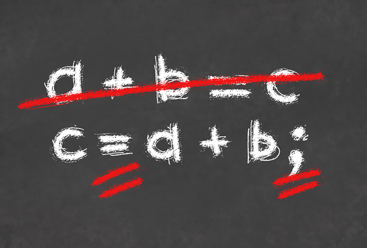

# Типы данных и операции
## Объявление переменных



Первые электронно-вычислительные машины создавались для того, чтобы производить сложные вычисления. Сейчас компьютеры используют в самых различных областях. Это и просмотр видео, и компьютерные игры, и обработка звука. Однако в основе работы компьютеров по-прежнему остаются именно вычисления. Изображение и звук появляются благодаря размещению чисел в ячейках памяти звуковой и видеокарты. 3D-эффект в играх — это результат обработки чисел алгоритмами вычислительной геометрии и так далее.

Отдельным типом данных можно (а в Java нужно) считать строки, но даже строки для компьютера — это на самом деле последовательности чисел — кодов символов. Например, в языке Си практически нет разницы между числами и символами, она проявляется в основном только при выводе. Поэтому очень важно понимать, как устроена в языке работа с числами.

Все типы данных в Java разделяются на два класса — примитивные и ссылки на объекты. На этом занятии мы будем рассматривать в основном только числовые примитивные типы.

Обычно алгоритм получает данные, размещает их в своей памяти, обрабатывает и возвращает результат. Функция main главного класса имеет тип void, то есть фактически ничего не возвращает, но мы все равно получаем результат, используя вывод.

Соответственно, для того чтобы написать минимально полезную программу, нужно знать, как организовать ячейки памяти для хранения данных, заводить так называемые переменные и выполнять вычисления с ними, вводить и выводить значения переменных (в простейшем случае с консоли и на консоль).

---

Для того чтобы завести переменную, можно в любом месте функции вставить конструкцию

`<тип> <имя переменной>[ = <значение>];`

Это так называемый псевдокод. В реальных программах слова в угловых скобках и сами угловые скобки не пишутся, а вместо них употребляются соответствующие конструкции языка. Квадратные скобки также не пишутся. Они означают, что данная часть кода не обязательна. Например, в программе создание переменной может выглядеть так:

`int a2;` или так: `double xx = .15;` (дробные числа в коде записываются через точку, при этом нулевая целая часть может опускаться).

Переменные могут называться любой последовательностью латинских букв, цифр и знаков подчеркивания, при этом не могут начинаться с цифры. Лучше всего в программах давать переменным «говорящие» имена. Например, переменную, в которой хранится ширина, стоит называть width. Старайтесь использовать именно английские названия. Транслит в программах выглядит плохо.

Основные числовые типы — int — целые числа и double — вещественные. Вывод чисел выполняется так же, как и строк, при помощи PrintStream, например
```java
int x = 5, y = 7;
System.out.println(x + y); 
```
выведет 12.

---

Для ввода переменных удобно использовать класс Scanner, вернее объект класса Scanner.
`Scanner in = new Scanner(System.in);`

Для ввода целых чисел нужно использовать функцию класса Scanner nextInt(), например
```java
int x = in.nextInt();
```
Для чтения вещественных чисел можно использовать функцию nextDouble(), но перед ее использованием нужно настроить Scanner на использование десятичной точки (а не запятой по обычному умолчанию), например, вот так:
`
in.useLocale(Locale.US);
`
Это нужно сделать всего один раз, лучше в самом начале функции main. Вывод вещественных чисел происходит как обычно.

Чтобы посчитать площадь круга с данным нецелым радиусом, можно написать:
```java
in.useLocale(Locale.US);
//…
double r = in.nextDouble();
System.out.println(3.1415 * r * r);
```


При вводе вещественных чисел дробную часть после точки можно опускать. То есть будет восприниматься корректно как 35,0 так и просто 35. (с точкой).
У вещественных чисел нет жестких ограничений на величину, как у типа int, но при работе с ними возникает погрешность, поэтому нужно быть осторожным.
Заметим, что при использовании Scanner могут возникать исключения. Если ввести некорректные данные, например, 14..a5, то программа закончится аварийно, потому что Scanner не сможет найти число в переданной ему информации. Этой ситуации можно избежать. В реальной программе следует перехватить исключение и вместо аварийного завершения программы сообщить пользователю о его ошибке и попросить ввести число еще раз.


---
## Программа A + B
```java
import java.util.*;
public class AplusB {
    public static void main(String[] args) {
        Scanner in = new Scanner(System.in);
        int a, b;
        a = in.nextInt();
        b = in.nextInt();
        int c = a + b;
        System.out.println(c);
    }
}
```
Можно объединить объявление переменных с чтением:

int a = in.nextInt(), b = in.nextInt();

Но тогда естественно эти строки писать после вывода строки «Введите два числа». Последние строки тоже можно объединить, и даже обойтись без переменной c

System.out.println("Сумма: " + (a + b));

У класса PrintStream есть методы вывода всех примитивных типов и еще один метод для вывода строк. Все объекты могут «представляться» строками автоматически. (Мы обсудим это позднее). И для строк (и только для них, для других классов — нет) возможно сложение с другими примитивными типами и строками. При этом происходит простое «склеивание», «конкатенация». Например, результат операции «х» + 1 — строка «x1». Таким образом, в нашем примере формируется одна строка и она выводится.

Все бинарные операции (операции, где участвуют две величины, например, умножение), за исключением операторов присваивания, левоассоциативны. а — b — с вычисляется как (а — b) — c, то есть «как в математике». Операторы присваивания правоассоциативны. Это означает, что а = b = с равнозначно а = (b = с), что позволяет объединять операции присваивания в цепочку.

---

Эту программу можно запустить на устройстве.
Запуск на устройстве

На мобильном устройстве программу можно запустить точно так же, как и Hello, world. При этом оставить строки import. Можно и сразу писать программу в TestPlatform, не создавая нового проекта и пользоваться различными конфигурациями запуска, как описано в конце предыдущего занятия. Работа этой программы на устройстве отличается тем, что по команде чтения Scanner’у показывается поле ввода, в котором требуется ввести переменную и нажать на Enter.

---

## Арифметические операции


С вычислениями в Java все достаточно стандартно. Можно использовать четыре арифметические операции (умножение записывается звездочкой (*), а деление прямым слешем (/)).
Приоритеты операций стандартны.

Но при программировании на языке Java нужно быть очень внимательным, учитывать особенности арифметических операций.

Арифметические операции могут вызвать переполнение.

Целые числа в Java (переменные типа int) не могут содержать значения большие 2^31 по модулю. Это чуть больше двух миллиардов. Когда результат операции превышает этот предел, возникает переполнение — ответ становится неверным.

Обязательно посмотрите, что выведет фрагмент:
```java
int x = 1000 * 1000;
System.out.println(x * x);
```
---

Деление целых чисел выполняется нацело.

Например, результат 5 / 3 равен 1.

Операция процент (%) позволяет вычислить остаток от деления. Например, 5 % 3 это 2. С отрицательными числами остаток от деления работает не так, как подсказывает интуиция.
 
Проверьте, что выведет строка:
`
out.println((-7) % 3);
`
и поймите, почему получается именно такой результат.

Операция взятия остатка очень часто используется в программировании. Например, проверку четности числа удобно делать так:

Cравнение в Java выполняется удвоенным знаком равенства (==) `
if (a % 2 == 0) …`

Операция % применима в Java не только к целым числам. Проверьте, что выведет команда

`System.out.println((12.72) % 3);`

Чтобы операция деления производилась без отсечения дробной части (обычное деление, не нацело) нужно, чтобы одно из чисел было нецелым (либо вещественной константой, либо переменной нецелого типа). Например, если

int a = 7, b = 8;

тогда команда `System.out.println((a + b) / 2);` выведет 7, 

а команда `System.out.println((a + b) / 2.0);` выведет 7.5.


---

## Операции с присваиванием

Чтобы изменить переменную, например, получить показания часов через минуту, обычно пишут примерно такой код:

minutes = minutes + 1;

Однако в Java есть более удобные средства. Можно записать:

minutes += 1;

Существуют комбинированные операции с равенством со всеми основными операциями. То есть возможно использовать -= /= %= и так далее. Нужно стараться использовать именно эти операции. Они выполняются быстрее, это понятнее и проще читается. Если увеличение или уменьшение должно быть именно на 1, то можно использовать операции ++ (инкремент) и — (декремент), например

minutes++;
++minutes;


---
## Обзор примитивных типов данных

Данные примитивных типов представляются фиксированным количеством двоичных разрядов.

Это очень важно, потому что задает ограничение на размер чисел. Например, если использовать всего три двоичных разряда, можно применять только 8 различных значений: 000, 001, 010, 011, 100, 101, 110 и 111. То есть представлять 8 различных чисел. В реальных типах используется значительно больше разрядов.
Целочисленные типы в Java
```
Название    Длина (байт/бит)	    Область значений
byte 	        1 (8) 	            -128 .. 127
short 	        2 (16) 	            -32.768 .. 32.767
char 	        2 (16) 	            '\u0000' .. '\uffff', или 0 .. 65.535
int 	        4 (32) 	            –2.147.483.648 .. 2.147.483.647
long 	        8 (64) 	            -9.223.372.036.854.775.808 .. 9.223.372.036.854.775.807 (примерно 1019)
```
Особое место среди числовых типов занимает тип char. С одной стороны, это «обычный» числовой тип в том смысле, что можно со значениями этого типа делать арифметические действия. Это беззнаковый тип, отрицательных значений этого типа не существует. С другой стороны, этот тип используется для представления символов. Java использует unicode — шестнадцатибитное представление символов. Поэтому значения можно задавать способами: 8667, '\u21DB' 

В Java можно использовать константы в шестнадцатеричном виде, если начинать их с префикса 0x. Например, 0xB — это одиннадцать. Это очень часто используется, например, в генерации R — основного файла ресурсов Android-приложения.
Вещественные типы в Java
```
Название    Длина (байт/бит)     Область значений по модулю
float 	    5 (40) 	          4⋅10−38.. 4⋅10−8
double 	    8 (64) 	          1.7⋅10−308 .. 1.7⋅10308
```
Вещественные числа можно записывать в экспоненциальной форме. Например 1.3e-25 означает 1.3⋅10−25

Константы типа float записывают с f на конце. Например, .5f.


##  Приведение примитивных типов


Если в выражении участвуют операнды разных типов, происходит их приведение. Приведение в бо́льшую сторону происходит автоматически, в меньшую нужно делать вручную.

Можно написать `double z = 5;`

Целое 5 при присваивании будет преобразовано в double, а вот `int x = 3 / 1.5;` НЕВЕРНО!

не скомпилируется, нужно приводить типы явно:

`int x = (int)(3 / 1.5);`

Правильно возвести 100 миллионов в квадрат можно так:
```
int x = 100 * 1000 * 1000;
System.out.println((long)x * x);
```
Достаточно при этом привести к типу long один из множителей

