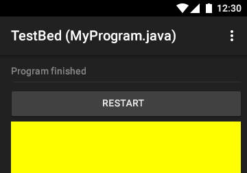

# Представление целочисленных данных в памяти
## Android-практикум: цвета RGB и другие атрибуты виджетов в XML

Люди редко используют двоичную систему для записи чисел, потому что она слишком объемная. Работая с двоичными числами, очень удобно использовать шестнадцатеричную систему счисления. 16 — четвертая степень двойки, поэтому перевести числа из двоичной системы в шестнадцатеричную можно очень легко.


Чтобы перевести число из двоичной системы в шестнадцатеричную, его нужно разбить на тетрады (четверки цифр), начиная с младшего разряда, в случае необходимости дополнив старшую тетраду нулями, и каждую тетраду заменить соответствующей шестнадцатеричной цифрой.
```
16 c/c	2 c/c	16 c/c	2 c/c
016 	00002 	816 	10002
116 	00012 	916 	10012
216 	00102 	A16:10 	10102
316 	00112 	B16:11 	10112
416 	01002 	C16:12 	11002
516 	01012 	D16:13 	11012
616 	01102 	E16:14 	11102
716 	01112 	F16:15 	11112
```
Например, число 10111000112 переведем в шестнадцатеричную систему счисления: `0010:1110:0011 = 2E316`. Для перевода шестнадцатеричного числа в двоичное необходимо каждую цифру заменить эквивалентной ей двоичной тетрадой:
`3E516 = 0011:1110:01012`

Программисты часто имеют дело с двоичными числами, но записывают их при помощи шестнадцатеричной системы счисления. Например, цвета принято кодировать тремя двухзначными шестнадцатеричными числами (это составляет один байт).

Любой цвет можно представить в виде комбинации трех основных цветов: красного, зеленого и синего (цветовые составляющие). Эти цвета беуртся за основу в модели RGB. Они удобны при воспроизведении цветов на мониторах компьютеров. И устроены таким образом, что воспроизводят цвета путем «перемешивания» именно этих составляющих.

При кодировании цвета с помощью трех байтов первый байт является красной составляющей, второй байт — зеленой, а третий — синей составляющей. Чем больше значение байта соответствующей цветовой составляющей (в пределах от 0 до FF16), тем больше ее насыщенность в итоговом цвете.

Белый цвет имеет все цветовые составляющие с максимальной насыщенностью FFFFFF16, R (red — красный) = FF000016, G (green — зеленый) = 00FF0016, B (blue — синий) = 0000FF16.

При программировании хорошим тоном является отделение логики работы программы от оформления. В Android-программах многое из того, что относится к оформлению, помещается в раздел ресурсов и хранится в XML-файлах.

Идея проста: не указывать в программе конкретный цвет или размер, а описать его в файле ресурсов, присвоив ему идентификатор, а дальше использовать именно этот идентификатор (ID). Это дает возможность изменять внешний вид программы без изменения программного кода.

Обычно для цветовых ресурсов используют файл colors.xml в подкаталоге /res/values. Но можно использовать любое произвольное имя файла, или даже вставить их в файл вместе со строковыми ресурсами в strings.xml. Android прочтет все файлы, а затем обработает их, присвоив им нужные ID.

---
##Практикум
Добавим цветности в TestPlatform.

Создайте новый файл XML: colors.xml

Цветовые ресурсы

Для работы с цветом используется тег, а цвет указывается в специальных значениях.
```
#RGB;
#RRGGBB;
#ARGB;
#AARRGGBB;
```
A — это альфа-канал, величина обратная прозрачности. То есть цвет #4000FF00 — это почти прозрачный зеленый. Например, в файле colors.xml можно написать


```
#f00
#FFFF00
#4000FF00
```
Мы описываем ресурсы — три цвета. После этого появится возможность использовать в других частях кода красный, желтый и прозрачно-зеленый цвета.

Определенные таким образом цвета можно использовать в других XML-файлах.

Например, в TestPlatform их можно использовать в файле разметки основной активности (там описываются элементы главного окна приложения).

Откройте файл разметки res ⇒ layout ⇒ activity_main.xml и сразу переключитесь к текстовому виду


### activity_main.xml
```xml
<LinearLayout xmlns:android="http://schemas.android.com/apk/res/android" 

    android:layout_width="match_parent"
    android:layout_height="match_parent"
    android:orientation="vertical">
 
    <EditText 
        android:id="@+id/valuePrompt"
        android:layout_width="match_parent"
        android:layout_height="wrap_content"
        android:hint="@string/enter_value"
        android:inputType="text"
        android:visibility="invisible">
    </EditText>
 
    <Button
        android:id="@+id/closeButton"
        android:layout_width="match_parent"
        android:layout_height="wrap_content"
        android:layout_gravity="center"
        android:onClick="restartUserProgram"
        android:text="@string/restart"
        android:visibility="gone" />
 
    <TextView
        android:id="@+id/consoleWrite"
        android:layout_width="match_parent"
        android:layout_height="match_parent" />
</LinearLayout>
```
Текст длинный, но это не программа, а просто разметка, разобраться несложно.

* LinearLayout — все окно,
* EditText — поле ввода,
* TextView — основное поле вывода программы,
* Button — кнопка закрытия, которая возникает после окончания работы запущенной консольной программы.

Например, зададим цвет основному полю вывода программы consoleWrite.

Просто добавим в описание новый параметр:
```xml
    <TextView
        android:id="@+id/consoleWrite"
        android:layout_width="match_parent"
        android:layout_height="match_parent"
        android:background="@color/yellow" />
        
```
По смыслу все очень похоже на CSS. Мы задаем элементу свойство — цвет фона.

После запуска основное поле TestPlatform станет желтым.



Обратите внимание на использование префикса @ для того, чтобы ввести ссылку ресурса — текст после этого префикса — имя ресурса. В этом случае мы не должны были указывать пакет, потому что мы ссылаемся на ресурс в нашем собственном пакете.

Можете попробовать добавить различным элементам разметки кроме android:background свойства android:textColor и android:TextColorHint (это свойство применяется, когда в поле ввода еще нет текста пользователя и там отображается подсказка).

Нужно заметить, что разные элементы поддерживают разные свойства, и это надо уточнять по документации. Также существуют предопределенные названия цветов. Такие ID доступны в пространстве имен android.R.соlor. Посмотреть цветовые значения цветов можно в документации 