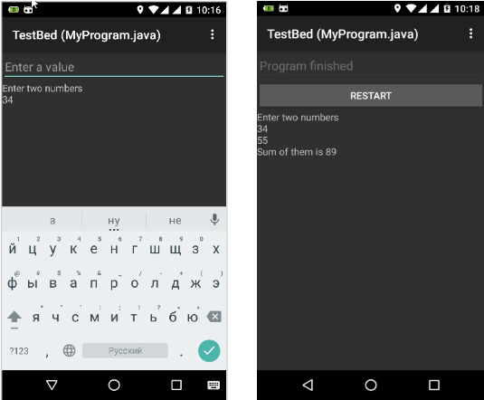
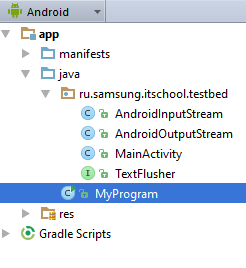

# TestPlatform
Песочница для запуска консольных Java-программ под Android



## Структура проекта
```text
TestPlatform/
  manifest/
    ...
  ru.itis.../
    ...
  res/
    ...
  
  
```

---
### `manifest`
Определяет какая activity (экран) будет запущена при старте приложения
Определение interceptor & filter
Установка иконки, темы, ориентации, названия, разрешений 

---
### `ru.itis..`
Бизнес логика нашего activity (откуда берется визуализация, поведение кнопок и тд)

---
### `res`
В Андроиде много чего ссылается на ресурсы. Какая id'шка (кнопки) была кликнута, которая хранится в ресурсах (`R.id`), шрифты, layout, картинки   

#### drawable
Все что рисуется: png, jpeg, svg, xml

#### layout
Верстка

#### values
Хранение неких констант (colour, dimension)

---
**Ограничения:**

Главный класс должен располагаться в корне (пример - MyProgram.java) запуск `"Run with coverage"`



Пример консольной программы
```java
import java.util.Scanner;
public class MyProgram{
    public static void main(String[] args){
        Scanner in = new Scanner(System.in);
        System.out.println("Enter two numbers");
        int x = in.nextInt(), y = in.nextInt();
        int sum = x + y;
        System.out.println("Their sum is " + sum);
    }
}
```